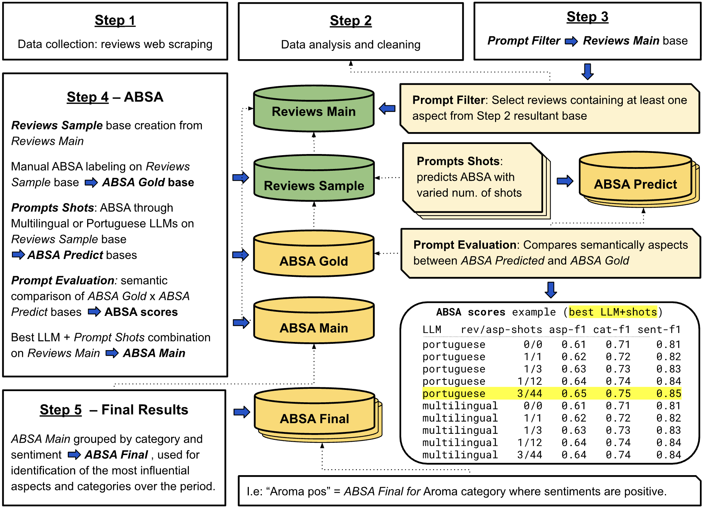

# Unsupervised Aspect-Based Sentiment Analysis through LLM: A Case Study of an Unlabeled Portuguese Beer Database

This repository contains the methodology tasks of the paper above.

## ABSTRACT 

This study investigates the application of Large Language Models (LLMs) to unsupervised Aspect-Based Sentiment Analysis (ABSA) in Portuguese, focusing on consumer reviews of Brazilian beers. We construct a novel domain-specific dataset comprising nearly 60,000 filtered reviews collected from a major Brazilian beer forum, along with a manually annotated gold-standard subset containing 1,712 labeled Beer Characteristics (BC), categories, and sentiment polarities. Two LLM families—one monolingual (Sabiá-3) and one multilingual (GPT-4o mini)—are systematically evaluated under zero-shot, one-shot, and few-shot prompting strategies. Results show that the best configuration achieves F1-scores of 0.857 for aspect extraction, 0.826 for category identification, and 0.552 for sentiment classification, with sentiment detection proving the most sensitive to prompt design. Using the optimal model and prompt configuration, a large-scale annotated dataset of over 880,000 extracted BC instances is generated, enabling longitudinal analysis of consumer perceptions from 2008 to 2025. Findings indicate that positive attributes such as refreshing mouthfeel and persistent foam dominate consumer praise. The proposed pipeline demonstrates that LLM-based ABSA can effectively uncover fine-grained consumer preferences in low-resource languages without extensive labeled data, offering a scalable and cost-effective tool for market intelligence and product development in the brewing industry.

## Methodology 

ABSA techniques powered by LLMs were applied to identify consumer preferences regarding BC, conducted on the textual content of user reviews. The following sections detail the materials and procedures employed in the study, as illustrated in Fig. 1. 

FIGURE 1.Procedure Fluxogram. Large arrows mean “generates”; small arrows mean “uses".

Steps 1 and 2 encompassed the processes of data collection, pre-processing, and preliminary analysis. In Step 3, a primary dataset—“Reviews Main”—was constructed by identifying and selecting valid reviews through LLM-based filtering technique. In Step 4, two distinct LLMs were evaluated for the ABSA tasks on a sample subset of the “Reviews Main” base (“Reviews Sample”). Based on comparative performance, the most effective model was selected for application to the full dataset (“Reviews Main”), generating an aspect-annotated version referred to as the “ABSA Main”. 
Step 5 generated the “ABSA Final” bases from the “ABSA Main” and “Reviews Main”, by grouping reviews by category and sentiment polarity (positive or negative) and by the year of the review in order to show the identification of the most influential BC and their categories in shaping overall product assessments and temporal analyses to track sentiment evolution over time.

## General instructions

For running all the Steps, you will need to get API keys from the LLMs OpenAI and Maritaca. 
The Steps that need the LMMs are Step 3, Step 4 and Step 5.

To get you keys please visit the following sites:
- https://platform.openai.com/docs/quickstart
- https://github.com/maritaca-ai/maritalk-api

Follow the instructions in the next sections for Installing, Configuring the system, Downloading the dataset and Running.
After these steps you can check the results as showed in the Results section.

## Installing

Before going ahead, install a python 3.11 version. 
The following steps will create a python virtual environment to not affect your system.

Get the code from this repository and install the python requirements.
~~~
cd ~/
git clone https://github.com/deniseiras/ACADEMIC_ABSA_beer
cd ~/ACADEMIC_ABSA_beer
python3.11 -m venv .venv
source .venv/bin/activate
pip install --upgrade pip
pip install -r requirements.txt
~~~

Now, clone openai_api and maritaca_api and install them:
~~~
cd ~/
git clone https://github.com/deniseiras/PORTFOLIO_py_openai_api.git
cd ~/PORTFOLIO_py_openai_api
pip install -r requirements.txt
cd ~/
git clone https://github.com/deniseiras/PORTFOLIO_py_maritaca_api.git
cd ~/PORTFOLIO_py_maritaca_api
pip install -r requirements.txt
~~~

## Configuring the system once

Create a env file named .env in your ~/ACADEMIC_ABSA_beer and and set your working path.
~~~bash
mkdir ~/ABSA_beer__workdir
cd ~/ACADEMIC_ABSA_beer
touch .env
~~~

Edit the file .env to the following content:
~~~
WORK_DIR="~/ABSA_beer__workdir"
~~~

Create a file named '.env' in ~/PORTFOLIO_py_openai_api/ to set a Open AI license. i.e.:
~~~bash
OPENAI_API_KEY=sk-........................
~~~

Create a file named '.env' in ~/PORTFOLIO_py_maritaca_api/ setting your license. i.e.:

~~~bash
MARITACAAI_API_KEY=123........................
~~~

## Downloading the dataset 

Download the dataset step_3_reviews_main.csv at the same directory defined in the WORK_DIR parameter in .env file.

[ABSA_beer](https://huggingface.co/datasets/deniseiras/ABSA_beer)     

~~~bash
cd ~/ABSA_beer__workdir
wget https://huggingface.co/datasets/deniseiras/ABSA_beer/blob/main/step_3_reviews_main.csv
~~~

## Running

The main program is based at absa_beer/absa_beer.py , which calls from Step1 to Step 7.
The Step 1 collects data from the site brejas.com.br, Step 2 does the pre-processing and the Step 3 generates the Main Base.

However, the base could be obtained by downloading it as shown in the "Downloading the dataset" section.

Each Step [number] has its own processing function called "run", which generates a dataset called "step_[number].csv". Each step uses the bases of the previous step.

All the datasets was previous available as shown in the "Downloading the datasets" section, so you may not need to run all the steps. I. e. the Steps from Step 1 to Step 3 are the most time demanding, and you shouldn't change this methods, otherwise you will have a differente dataset, because the site brejas.com.br might be updated with new reviews. 

If you want to run from the Step 4 (ABSA), you need to comment the calling of the Steps 1 to 3 in absa_beer.py file

To run all the Steps (except the commented calls):
~~~bash
cd ~/ACADEMIC_ABSA_beer
export PYTHONPATH=./:../PORTFOLIO_py_openai_api/:../PORTFOLIO_py_maritaca_api/
python absa_beer/absa_beer.py 
~~~

If you need further assistance, please do no hesitate to contact me.

## Results

Each step generates the file step_[number].csv, containing the dataset resulting from each step.

